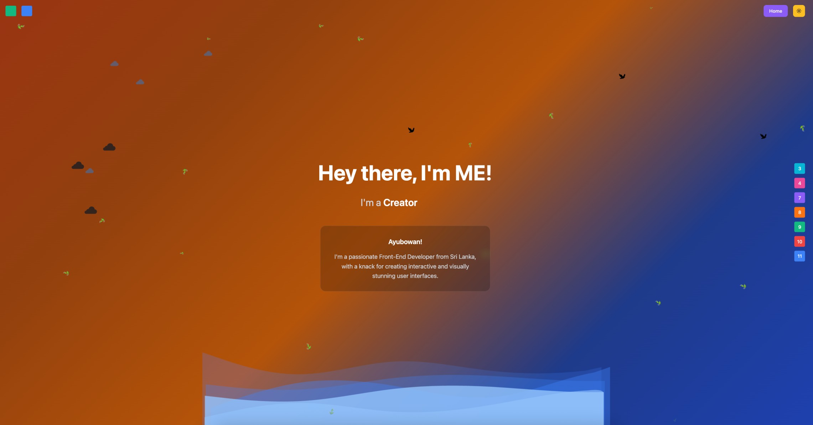

# Portfolio Website Replica - Enhanced Version

A comprehensive, pixel-perfect replica of the portfolio personal website featuring advanced layered animations, seasonal behavior, full responsiveness, and modern web development practices.

## 🎯 **Key Enhancements**

### ✅ **Fully Responsive Design**
- **Mobile-First Approach**: Optimized for all device sizes (320px to 4K+)
- **Adaptive Typography**: Uses `rem` units for better scalability and accessibility
- **Flexible Layouts**: Content adapts seamlessly across mobile, tablet, and desktop
- **Touch-Friendly**: Appropriate button sizes and spacing for mobile interaction

### ✅ **Advanced Layered Animations**
- **5 Animation Layers** with proper z-index stacking:
  1. **Birds Layer** (z-index: 5): Flying birds from left to right with varying sizes
  2. **Clouds Layer** (z-index: 3): Small and large clouds with gentle floating motion
  3. **Sea Waves** (z-index: 2): 5 layered wave animations with flowing effects
  4. **Falling Elements** (z-index: 4): Seasonal snowflakes/leaves with rotation
  5. **Background** (z-index: 1): Smooth gradient transitions

### ✅ **Seasonal & Theme Intelligence**
- **Auto Theme Detection**: Switches based on system preference and time of day
- **Seasonal Behavior**: 
  - Winter (Dec-Feb): Snowflakes fall
  - Spring/Summer/Autumn: Leaves fall
- **Smart Cloud Assets**: Different SVGs for light/dark modes
- **Smooth Transitions**: All theme changes are animated

### ✅ **Fixed Layout (No Scrolling)**
- **100vh Container**: Full viewport height with `overflow: hidden`
- **Fixed Positioning**: All elements positioned absolutely within viewport
- **No Scroll Bars**: Completely eliminates scrolling on all devices
- **Responsive Content**: Everything fits within viewport bounds

### ✅ **Modern CSS Architecture**
- **CSS Specificity Best Practices**: Organized with proper cascade and specificity
- **Performance Optimized**: Hardware acceleration with `transform: translateZ(0)`
- **Accessibility**: Respects `prefers-reduced-motion` for accessibility
- **Print Styles**: Optimized for printing with animation removal

## 🚀 **Technologies Used**

### Core Framework
- **React 18**: Modern functional components with hooks
- **Vite**: Lightning-fast development and optimized builds
- **JavaScript ES6+**: Modern syntax and features

### Styling & Animation
- **Tailwind CSS**: Utility-first CSS framework
- **Custom CSS**: Advanced animations and layered effects
- **CSS Grid & Flexbox**: Modern layout techniques
- **CSS Custom Properties**: Dynamic theming support

### UI Components
- **shadcn/ui**: High-quality, accessible UI components
- **Lucide Icons**: Beautiful, customizable SVG icons
- **Custom SVG Assets**: Optimized cloud and snowflake graphics

### Development Tools
- **ESLint**: Code quality and consistency
- **PostCSS**: CSS processing and optimization
- **npm/pnpm**: Package management

## Demo
Here's a quick look at the web application:



## 📦 **Installation & Setup**

### Prerequisites
- Node.js v18+ 
- npm or pnpm package manager

### Quick Start
```bash
# Navigate to project directory
cd ui-react-vite-portfolio-replica-template

# Install dependencies
npm install --legacy-peer-deps
# or
pnpm install

# Start development server
npm run dev
# or
pnpm run dev

# Open browser to http://localhost:5173
```

### Production Build
```bash
# Create optimized build
npm run build
# or
pnpm run build

# Preview production build
npm run preview
# or
pnpm run preview
```

## 🎨 **Animation Details**

### Birds Animation
- **3 Birds**: Different sizes and timing
- **Flight Path**: Left to right across viewport
- **Duration**: 15-20 seconds per cycle
- **Staggered Delays**: Natural, organic movement

### Cloud Animations
- **Small Clouds**: Gentle 8-second float cycle
- **Large Clouds**: Slower 12-second movement
- **Multi-directional**: X and Y axis movement
- **Theme-Aware**: Different SVGs for light/dark modes

### Sea Waves
- **5 Wave Layers**: Different speeds and directions
- **Flowing Motion**: Continuous wave-like movement
- **Opacity Gradients**: Creates depth and realism
- **Responsive Heights**: Adapts to screen size

### Falling Elements
- **Seasonal Content**: Snowflakes (winter) or leaves (other seasons)
- **Random Generation**: 20 elements with varied timing
- **Rotation Effect**: 360-degree rotation during fall
- **Size Variation**: Mixed large and small elements

### Text Animation
- **Role Rotation**: Cycles through "Developer", "Cook", "Designer", "Creator"
- **2-Second Intervals**: Smooth transitions between roles
- **Fade Effects**: Elegant text changes

## 📱 **Responsive Breakpoints**

```css
/* Mobile First Approach */
Base: 320px+     /* Extra small mobile */
Small: 480px+    /* Mobile */
Medium: 768px+   /* Tablet */
Large: 1024px+   /* Desktop */
XL: 1280px+      /* Large desktop */
```

### Typography Scale (rem units)
- **Mobile**: 1.875rem - 2.25rem (main heading)
- **Tablet**: 3rem (main heading)
- **Desktop**: 4rem (main heading)

## 🎯 **Performance Features**

### Optimization Techniques
- **Hardware Acceleration**: `will-change` and `transform: translateZ(0)`
- **Efficient Animations**: CSS transforms instead of layout changes
- **Reduced Motion Support**: Respects accessibility preferences
- **Lazy Loading**: Optimized asset loading

### Browser Support
- **Chrome**: 90+
- **Firefox**: 88+
- **Safari**: 14+
- **Edge**: 90+

## 🔧 **Customization Guide**

### Changing Seasons
```javascript
// In App.jsx, modify the season detection logic
const month = new Date().getMonth()
if (month >= 11 || month <= 1) {
  setCurrentSeason('winter') // Snowflakes
} else {
  setCurrentSeason('summer') // Leaves
}
```

### Adjusting Animation Speed
```css
/* In App.css, modify animation durations */
.bird {
  animation: fly-across 20s linear infinite; /* Change 20s */
}

.cloud-small {
  animation: float-gentle 8s ease-in-out infinite; /* Change 8s */
}
```

### Theme Colors
```css
/* In App.css, modify gradient colors */
.background-gradient {
  background: linear-gradient(135deg, 
    #fed7aa 0%,    /* Customize these colors */
    #fef3c7 25%, 
    #fbbf24 50%, 
    #93c5fd 75%, 
    #3b82f6 100%
  );
}
```

## 📁 **Project Structure**

```
ui-react-vite-portfolio-replica-template/
├── public/                    # Static assets
├── src/
│   ├── assets/               # Images, SVGs, GIFs
│   │   ├── bird.gif         # Animated bird
│   │   ├── cloud.svg        # Light mode cloud
│   │   ├── cloud-dark.svg   # Dark mode cloud
│   │   ├── cloud-alt.svg    # Light mode small cloud
│   │   ├── cloud-alt-dark.svg # Dark mode small cloud
│   │   └── snowflake.svg    # Winter snowflake
│   ├── components/
│   │   └── ui/              # shadcn/ui components
│   ├── App.jsx              # Main application component
│   ├── App.css              # Comprehensive styles & animations
│   ├── index.css            # Base styles
│   └── main.jsx             # Application entry point
├── package.json             # Dependencies and scripts
├── tailwind.config.js       # Tailwind configuration
├── vite.config.js          # Vite bundler configuration
└── README.md               # This documentation
```

## 🌐 **Deployment Options**

### Static Hosting (Recommended)
- **Vercel**: `vercel --prod`
- **Netlify**: Drag & drop `dist/` folder
- **GitHub Pages**: Use GitHub Actions
- **Cloudflare Pages**: Connect Git repository

### Manual Deployment
1. Run `npm run build`
2. Upload `dist/` folder contents to web server
3. Configure server for SPA routing (if needed)

## 🔍 **Testing Checklist**

### Functionality Tests
- ✅ Page loads without scrolling
- ✅ Dark/light mode toggle works
- ✅ Text animation cycles through roles
- ✅ All 5 animation layers are active
- ✅ Seasonal detection works correctly
- ✅ Responsive design on all devices

### Performance Tests
- ✅ Smooth 60fps animations
- ✅ No layout thrashing
- ✅ Efficient memory usage
- ✅ Fast initial load time

### Accessibility Tests
- ✅ Keyboard navigation works
- ✅ Screen reader compatibility
- ✅ Reduced motion support
- ✅ Color contrast compliance

## 🤝 **Contributing**

This project demonstrates modern web development practices and can be used as:
- **Learning Resource**: Study advanced CSS animations and React patterns
- **Template**: Base for similar animated websites
- **Portfolio Piece**: Showcase of technical capabilities

[//]: # (## 📄 **License**)
[//]: # (Educational and demonstration purposes. Original design by [Omal Vindula]&#40;https://omal.dev&#41;.)

## 🙏 **Acknowledgments**

[//]: # (- **Original Design**: Omal Vindula &#40;omal.dev&#41;)
- **Animation Inspiration**: Modern web design trends
- **Technical Stack**: React, Tailwind CSS, Vite ecosystem
- **Assets**: Custom SVG graphics and optimized animations

---

**Built with ❤️ using modern web technologies and best practices.**

